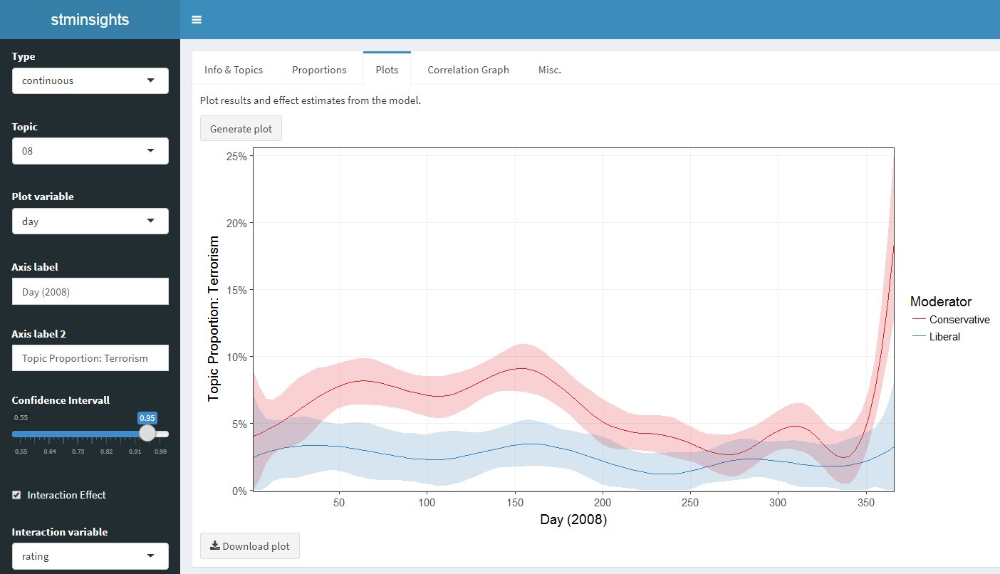

<!-- README.md is generated from README.Rmd. Please edit that file -->

# stminsights

[](https://travis-ci.org/methodds/stminsights)
[](https://ci.appveyor.com/project/methodds/stminsights)
[](https://cran.r-project.org/package=stminsights)
[](https://cran.rstudio.com/web/packages/stminsights/index.html)



## A Shiny Application for Structural Topic Models

This app enables interactive validation, interpretation and
visualisation of [Structural Topic
Models](http://structuraltopicmodel.com) (STM). Stminsights is focused
on making your life easier after fitting your STM models. In case you
are not familiar with STM, the [package
vignette](https://cran.r-project.org/web/packages/stm/vignettes/stmVignette.pdf)
is an excellent starting point.

## How to Install

You can download and install the latest development version of the app
by running `devtools::install_github('methodds/stminsights')`.

For Windows users installing from github requires proper setup of
[Rtools](https://cran.r-project.org/bin/windows/Rtools/), for which a
tutorial is available
[here](https://github.com/stan-dev/rstan/wiki/Install-Rtools-for-Windows).

stminsights can also be installed from CRAN by running
`install.packages('stminsights')`.

## How to Use

After loading stminsights you can launch the shiny app in your browser:

``` r
library(stminsights)
run_stminsights()
```

You can then upload a `.RData` file which should include:

  - one or several `stm` objects.
  - one or several `estimateEffect` objects.
  - an object `out` which was used to fit your stm models.

As an example, the following code fits two models and estimates effects
for the [Political Blog
Corpus](http://www.sailing.cs.cmu.edu/main/?page_id=710). Afterwards,
all objects required for stminsights are stored in
`stm_poliblog5k.RData`.

``` r
library(stm)

out <- list(documents = poliblog5k.docs,
            vocab = poliblog5k.voc,
            meta = poliblog5k.meta)

poli <- stm(documents = out$documents, 
            vocab = out$vocab,
            data = out$meta, 
            prevalence = ~ rating * s(day),
            K = 20)
prep_poli <- estimateEffect(1:20 ~ rating * s(day), poli,
                            meta = out$meta)

poli_content <-  stm(documents = out$documents, 
                     vocab = out$vocab,
                     data = out$meta, 
                     prevalence = ~ rating + s(day),
                     content = ~ rating,
                     K = 15)  
prep_poli_content <- estimateEffect(1:15 ~ rating + s(day), poli_content,
                                    meta = out$meta)

save.image('stm_poliblog5k.RData')
```

After launching stminsights and uploading the file, all objects are
automatically imported and you can select which models and effect
estimates to analyze.

In addition to the shiny app, several helper functions are available,
e.g. `get_effects()` for storing effect estimates in a tidy dataframe.

## How to Deploy on Shiny Server

Deploying stminsights to your own shiny server is simple: Place the file
`app.R`, which is located at `inst/app` of this package, to a folder in
your server directory and you should be good to go.

To test stminsights on my server, you can download
`stm_poliblog5k.RData`
[here](http://polsoz.uni-bamberg.de:1337/data/poliblog/stm_poliblog5k.RData)
and upload it at www.polsoz.uni-bamberg.de/stminsights.

## Citation

If you use stminsights for your publications please consider citing
it:

``` 
  Carsten Schwemmer (2018). stminsights: A Shiny Application for Inspecting
  Structural Topic Models. R package version 0.2.0.
  https://github.com/methodds/stminsights
```

A BibTeX entry for LaTeX users is:

``` 
  @Manual{,
    title = {stminsights: A Shiny Application for Inspecting Structural Topic Models},
    author = {Carsten Schwemmer},
    year = {2018},
    note = {R package version 0.2.0},
    url = {https://github.com/methodds/stminsights},
  }
```
