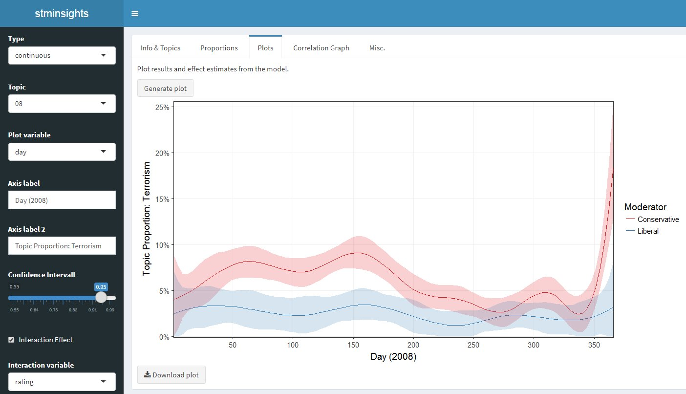

```{r setup, include = FALSE}
knitr::opts_chunk$set(
  collapse = TRUE,
  comment = "#>"
)
```

## A Shiny Application for Inspecting Structural Topic Models 

Topic models are widely used statistical models to reduce the dimensionality of textual data. Although the approach is quantitative in nature, model selection and validation of topic model results can be quite labor intensive, as it requires qualitative inspection of many documents and terms. This is were stminsights comes in: the package enables interactive validation, interpretation and visualization of one or several [Structural Topic Models](http://structuraltopicmodel.com) (stm). In case you are not familiar with stm, the [package vignette](https://cran.r-project.org/web/packages/stm/vignettes/stmVignette.pdf) is an excellent starting point.

## How to Install

Stminsights can be installed from CRAN by running ``install.packages('stminsights')``.

You can also download the latest development version of the app by running ``devtools::install_github('methodds/stminsights')``.    

For Windows users installing from github requires proper setup of [Rtools](https://cran.r-project.org/bin/windows/Rtools/), for which a tutorial is available [here](https://github.com/stan-dev/rstan/wiki/Install-Rtools-for-Windows).


## How to Use

### Preparation

The main part of stminsights is an interactive shiny application, which requires a `.RData` file as input. This file should include:

- one or several `stm` objects.
- one or several `estimateEffect` objects.
- an object `out` which was used to fit your stm models and contains documents, vocabulary and metadata.

As an example, the following code uses the [quanteda](https://quanteda.io/) package to prepare the gadarian corpus for structural topic modeling. Afterwars, two models and estimates effects are computed and all objects required for stminsights are stored in `stm_gadarian.RData`: 


```{r, eval = FALSE}
library(stm)
library(quanteda)

# prepare data
data <- corpus(gadarian, text_field = 'open.ended.response')
docvars(data)$text <- texts(data)
data <- dfm(data, stem = TRUE, remove = stopwords('english'),
           remove_punct = TRUE) %>% dfm_trim(min_count = 2)
out <- convert(data, to = 'stm')

# fit models and effect estimates
gadarian_3 <- stm(documents = out$documents,
                 vocab = out$vocab,
                 data = out$meta,
                 prevalence = ~ treatment + s(pid_rep),
                 K = 3, verbose = FALSE)
prep_3 <- estimateEffect(1:3 ~ treatment + s(pid_rep), gadarian_3,
                        meta = out$meta)
gadarian_5 <- stm(documents = out$documents,
                 vocab = out$vocab,
                 data = out$meta,
                 prevalence = ~ treatment + s(pid_rep),
                 K = 5, verbose = FALSE)
prep_5 <- estimateEffect(1:5 ~ treatment + s(pid_rep), gadarian_5,
                        meta = out$meta)

# save objects in .RData file
save.image('stm_gadarian.RData')
```

### Interactive application

After preparing the `.RData` file, the shiny application can be launched with `run_stminsights()`:

```{r, eval = FALSE}
library(stminsights)
run_stminsights()
```



Hovering over UI elements displays tooltips that assist users in navigating through the application. Stminsights is organized as a dashboard with five columns that serve different purposes:


- Info & Topics: 

    - load the `.RData` file and select models as well as effect estimates
    - inspect the most important terms and documents for topics
    - assign labels to topics
    
- Proportions: 

    - show proportions for each topic
    - export proportion plots
    
- Plots: 

    - create different visualizations for the output of the selected model
    - export effect plots
    
- Correlation Graph: 

    - create visualizations of the correlation network between topics
    - export correlation plots
    
- Misc: 

    - export of information about the select model in spreadsheet format
    - calculate diagnostics for evaluating all models in the `.RData`
    - export diagnostic plots
    

    
### Utility functions

Although the shiny application includes several options for exporting and visualizing the output from structural topic models, users may wish to create their own plots in different formats. For such cases stminsights offers three utility functions that can be used outside of the shiny application:

- `get_effects()`: create a dataframe including prevalence effects for one stm model
- `get_network()`: create a [tidygraph](https://github.com/thomasp85/tidygraph) for correlation network of one stm model
- `get_diag()`: create a dataframe including statistical diagnostic measures for several models


